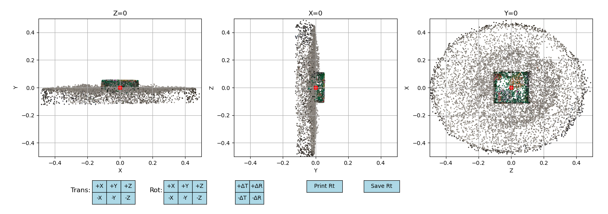
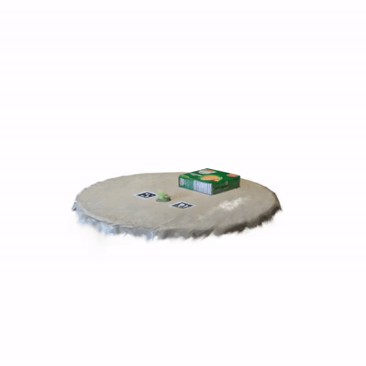

# Interact3D: Interactive 3D Scene Modeling using Image-Based 3D Gaussian Splatting

# Environment Setup

```bash
conda activation scripts here
```

This project deals with multiple files. So, we suggest to make a separate empty workspace directory to put everything in.

```bash
mkdir WORKSPACE=/path/to/new/workspace/directory
export WORKSPACE=/path/to/new/workspace/directory
```

# Step 1: Data Preparation

First, collect bunch of images of an static scene. For this you can capture images of a target object from multiple views and put it inside a directory. Or you can capture a video an then extract the video frames using script below.
```
python scripts/
```

# Step 2: Static 3D Reconstruction using Gaussian Splatting

From a set of images, you can do point cloud reconstruction using COLMAP which also recovers the camera poses that can be used to train Gaussian Splatting.

Run COLMAP:

```bash
ns-process-data images --data $WORKSPACE/images --output-dir $WORKSPACE/colmap
```

Train a Gaussain Splatting Model:

```bash
ns-train splatfacto --data $WORKSPACE/colmap --output-dir $WORKSPACE/gaussian_splats
```

Save the ply file at: `$WORKSPACE/gaussian.ply`

# Step 3: Point Cloud Alignment


The Gaussian Splat model can have weird orientation, which may not be idea to perform interactive actions. Hence, you need to align the point cloud so that flat ground surface faces exactly to +Y axis direction. Moreover, place all the ground floor elements below Y=0 plane. You can use our Point Cloud Pre-Processor tool for this task.


```bash
python interact3d/pointcloud/preprocessor.py --ply /path/to/ply/file
```

Here, **ply file** is the output ply from the Gaussian Splatting reconstruction from step 2.



# Step 4: Point Cloud Segmentation

Now, the point cloud needs to be segmented and separated. Here, we detect an object of interest and segment out its 3D points, all the rest points are considered as background points.

Get Top view render of the scene.
```bash
python scripts/render.py --ply /path/to/ply/file --mode=topview
```

Align the Rendered Top View to Actual Point Cloud
```bash
python interact3d/pointcloud/image_to_point_align.py --ply /path/to/ply/file
```

Generate Point cloud segmentation
```bash
python interact3d/pointcloud/segmenter.py --prompt object_description
```

# Step 5: Interaction

Here you can interact with the object. For now you can pick up the object and place it any point in 3d space, then rotate the body as well. Then drop the object from that pose.

For example to pick up the object to location (0.1,0.3,1.0) and rotate it by (15,30,45) degrees, use following command:
```bash
python interact3d/simulation/simulate.py -x=0.1 -y=0.3 -z=1.0 -r=15 -p=30 -y=45
```

# Step 6: Render Frames

Now, you can render frames to create high feidility Gaussian Splatting rendering of interacted object
```bash
python scripts/render.py --ply /path/to/ply/file --mode=video
```
You will get final output at `$WORKSPACE/frames/output.mp4`

 